# AC215 - SmartEats 
## This is the project for APCOMP215, 2024 Fall. 

### Project:
In this project, we aim to develop SmartEats, an AI-powered application that analyzes food images, predicts disease risks based on dietary habits, and offers personalized nutrition advice. 
an application named SmartEats, which will take the food image as input from users and generate nutrition components with advise and potential disease risks. It will first require users to upload food pictures, and then it will use image recognition to estimate nutritional components like protein and fats and also display the amounts of each
component ideally. Based on the results, SmartEats will calculate calories, assess potential health risks, and provide tailored dietary suggestions, such as healthy recipes.

**Team Members:**
Jiayi Sun, Ninghui Hao, Qianwen Li, Taiyang Chen, Yantong Cui

**Group Name:**
The SmartEats Group

### Project Organization
```
├── .github/workflows
│   ├── CI-CD.yml                          
│   └── pre-commit.yml           
├── data
├── images
│   ├── Coverage-report.png                 
│   ├── api-list-SmartEats.png                  
│   ├── solution.jpg                       
│   └── tech.png                 
├── midterm_presentation
│   └── SmartEats_AC215_M3_slides.pdf      # midterm presentation slides
├── notebooks
│   ├── AC215 - EDA.pdf                    # EDA pdf file
│   ├── AC215_image_EfficientNet.ipynb     # train EfficientNet model
│   ├── AC215_image_VGG_new.ipynb          # train VGG model
│   ├── LLM-fintuning-Documentation.pdf    # Documentation of the LLM fine-tuning process
│   ├── LLM_RAG_preprocessing.ipynb        # construct the RAG vector database
│   ├── data_versioning_cloud_storage.ipynb# view version of the dataset
│   ├── dataset3_EDA&preprocessing.ipynb   # EDA for nutrtion-disease dataset
│   ├── frontpage_v2.html                  # HTML file for application front page
│   ├── frontpage_v2.jpg                   # screenshot of front page
│   ├── image_EDA.ipynb                    # EDA for image datasets
│   └── predict_disease_ML.ipynb           # fine-tuning of a XGBClassifier model
├── references
├── reports
│   ├── APCOMP215 Project Proposal.pdf
│   ├── DataPipeline1.jpg                  # Pipeline running screenshot
│   ├── DataPipeline2.jpg                  # Pipeline running screenshot
│   ├── Examples.pdf                       # Some example inputs&outputs
│   └── Test_Documentation.pdf             # test documentaton
│   └── Final_output.png                   # Final output example
├── secrets
├── src_1container
│   ├── api                 
│   ├── docker-volumes/chromadb                   
│   └── frontend
│   └── models
└── test_action                            # container to test CI 
    ├── Dockerfile                         # To build the container for 
    ├── Pipfile                            # Define packages used in data versioning
    ├── Pipfile.lock
    ├── docker-entrypoint.sh 
    ├   ...
    ├── run-test.sh                        # shell script of running pytest within container
    └── tests.py                           # test script
```

## Milestone5 

In this milestone, we deploy our application to a Kubernete cluster on GCP with manul scaling. We work on ansible playbooks to automate the provisioning and deployment of the infrastructure and application, including the kubernetes cluster. We set up a CI/CD pipeline using Github Actions, which runs unit test across every container, runs integration tests corss the explosed API on every pull request. We also implemented a ML workflow for 1 model. 

### Architectures:
#### Solution Architecture
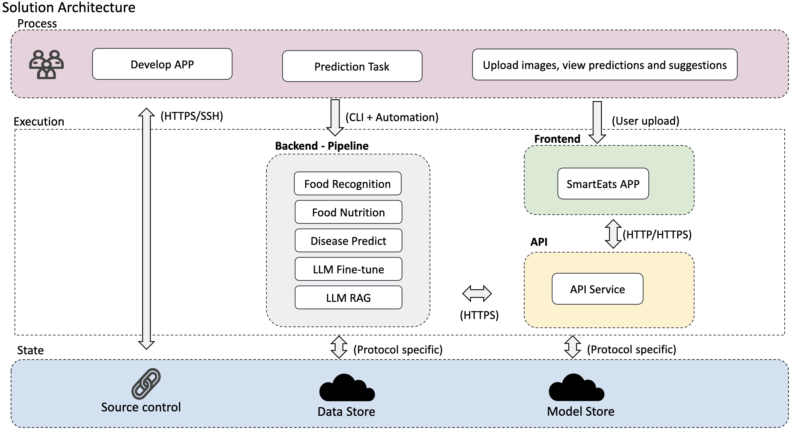
#### Technical Architecture
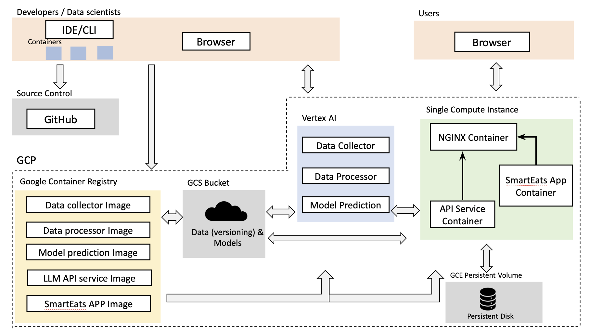


### Models:
1. **food-classification:** Recognizes the food in an image and stores the output back to Google Cloud Storage (GCS).
    - **Input:** Image and required secrets (provided via Docker)
    - **Output:** Name of the detected food name and predicted probability of the food
2. **food_to_nutrition:** Links the food predicted from food_classification model & weight user inputs to the nutrient components and stores the output back to GCS.
    - **Input:** Food item predicted, the weight user inputs, and required secrets (provided via Docker)
    - **Output:** Nutrition components and calories of the food item identified
3. **nutrition_predict_disease:** Uses the nutritional components and calories of the food item from food_to_nutrition model to predict the risk of four chronic diseases. 
    - **Input:** Nutritional information of the food item, and required secrets (provided via Docker)
    - **Output:** Predicted probabilities for the risk of developing diseases, including obesity, diabetes, hypertension, and high cholesterol
4. **llm-rag:** Prepares data for the RAG model, including tasks such as chunking, embedding, and populating the vector database; Invokes fine-tuned model from fine-tuned LLM model with RAG to generate diatery suggestions
    - **Input (RAG Setup):** Processed Raw data as txt. file, and user query text.
    - **Output (RAG Setup):** Chunked data (.jsonl file), embedded data (.jsonl file), created ChromaDB instance, LLM response corresponding to the user query text, and LLM responses to our default evaluation questions (uploaded to GCP bucket as csv for different RAG configuration)
    - **Input (RAG Usage):** Processed prompts containing previous outputs from container 2 and 3. The format of prompt is "Outputs from model 2 and 3, Could you give us some dietary advice based on these information?"
    - **Output (RAG Usage) :** The answer from fine-tuned LLM model with RAG to give response based on prompts.
5.  **gemini-finetuner:** Processes datasets used for fine-tuning and perform fine-tuning process in GCP.
    - **Input:** Processed Question Answering datasets as jsonl file, each entry has only question and answer parts.
    - **Output:** Fine-tuned LLM base model deployed as a endpoint for later RAG process.
      

### Deploy on GCP:
1. Build deployment container
    ```
    cd src_1container/deployment
    sh docker-shell.sh
    ```
    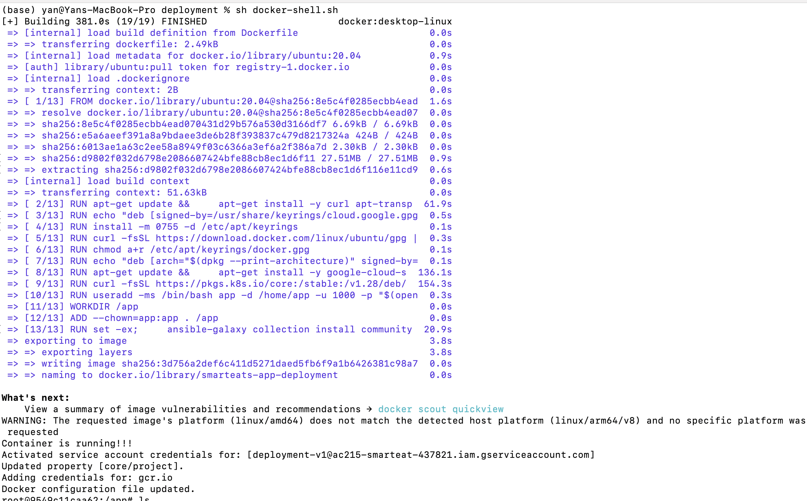
   
2. Deployment using Ansible Playbook 
    ```
    ansible-playbook deploy-docker-images.yml -i inventory.yml 
    ansible-playbook deploy-create-instance.yml -i inventory.yml --extra-vars cluster_state=present
    # get the IP address of the compute instance from GCP Console and update the appserver>hosts in inventory.yml file
    ansible-playbook deploy-provision-instance.yml -i inventory.yml
    ansible-playbook deploy-setup-containers.yml -i inventory.yml
    ansible-playbook deploy-setup-webserver.yml -i inventory.yml
    ```
    The application is able to be up at `http://<External IP>/`
   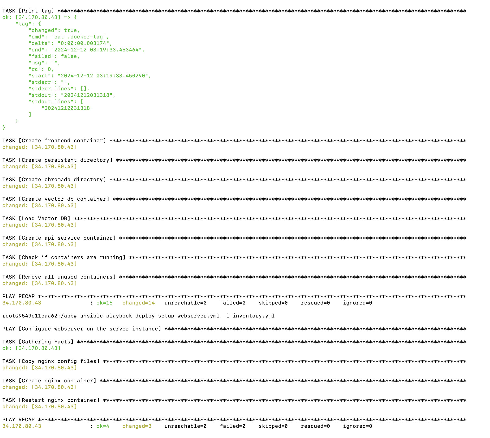
   
4. Deployment as Kubernetes cluster
   ```
   ansible-playbook deploy-docker-images.yml -i inventory.yml 
   ansible-playbook deploy-k8s-cluster.yml -i inventory.yml --extra-vars cluster_state=present
   ```
   The application is able to be up at `http://<YOUR INGRESS IP>.sslip.io`
   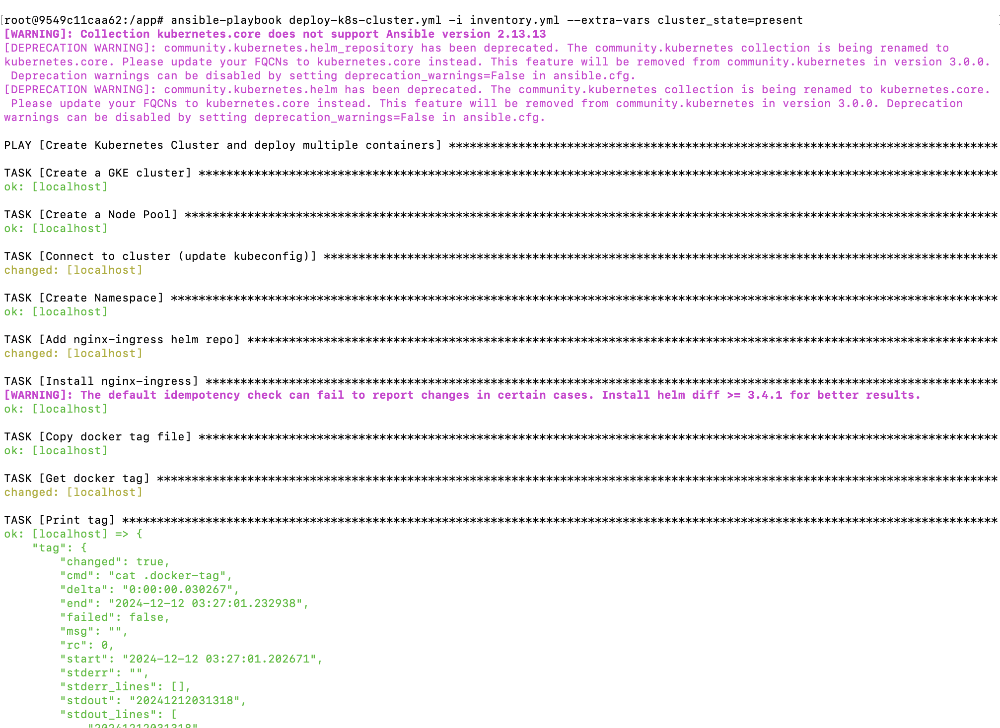
   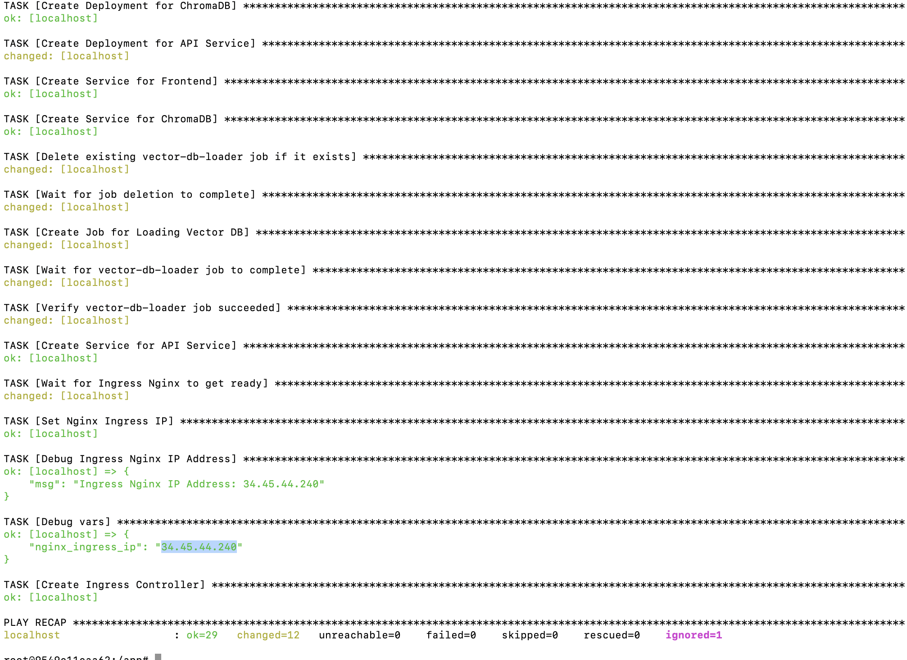
   
### CI/CD
#### Continuous Integration (CI)
We implemented a CI pipeline set up in GitHub Actions that automatically triggers the testing and integration process whenever a commit is made. 
The yaml files can be found under `.github/workflows/CI.yml`.

 - #### Coverage Report for Unit Tests & Integration test:
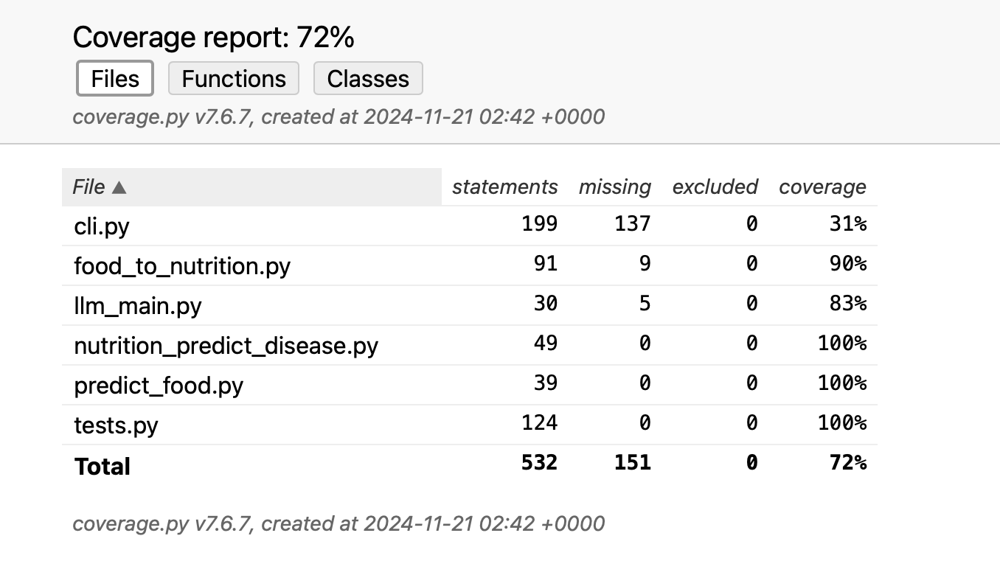

#### Continuous Deployment (CD)
1. Ensure Kubernetes Cluster is running at `http://<YOUR INGRESS IP>.sslip.io`.
2. Make some changes to the app, such as updating the color and font of the text in the frontend.
    ```
    <h3 className="feature-card-title text-xl font-semibold mb-2 text-blue-600">AI Chatbot</h3>
    ```
3. Run the deploy app action by running following code. Add `/deploy-app` to the commit message to re-deploy the frontend and backend. Do this in the `src_1container` folder outside the container.
    ```
    git add .
    git commit -m "update frontend and backend /deploy-app"
    git push
    ```
    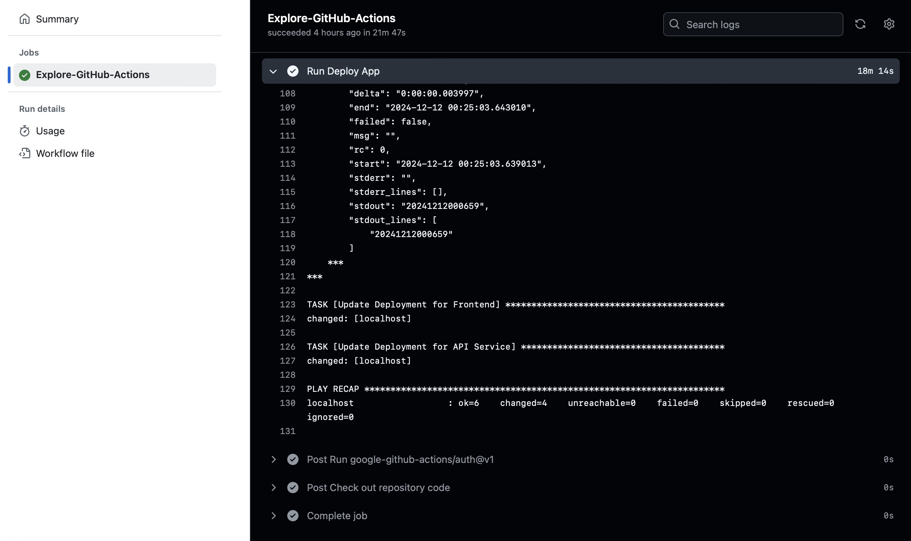

    - ####
    

### User Interfaces:
- **Home Page:**
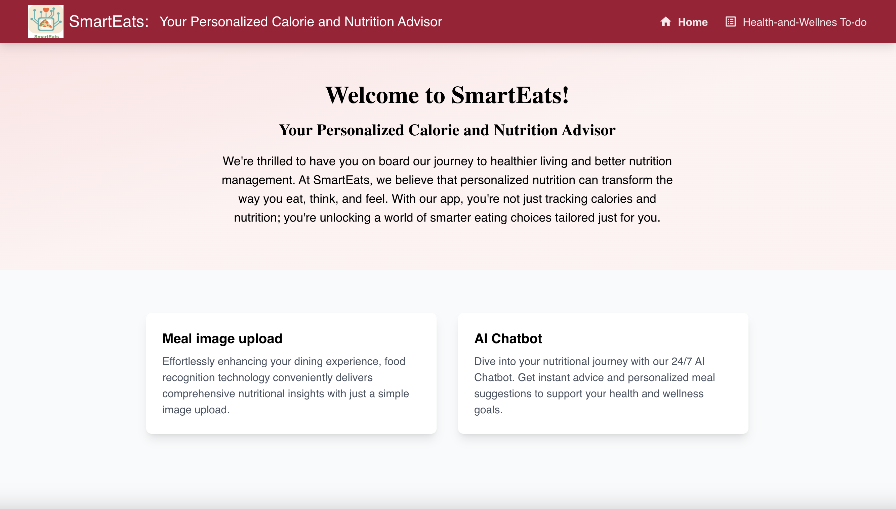
- **Meal Image Uploading Page:**
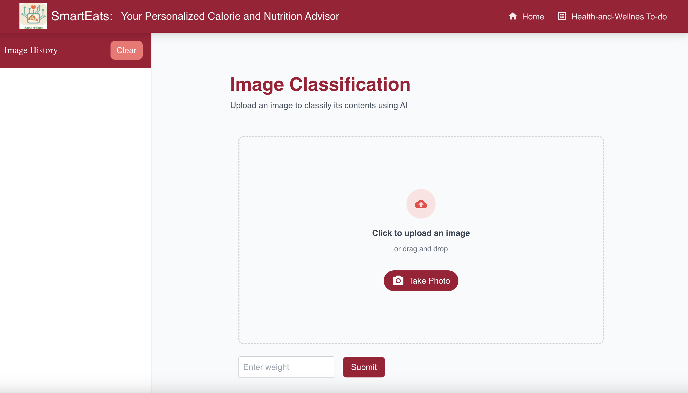
- **Example:**
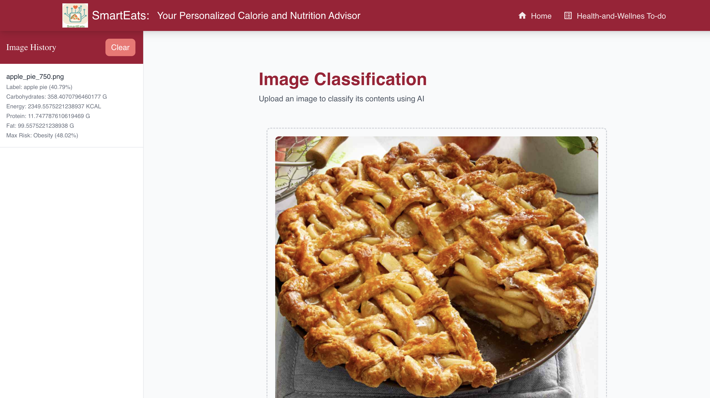
- **AI Chatbot Page:**
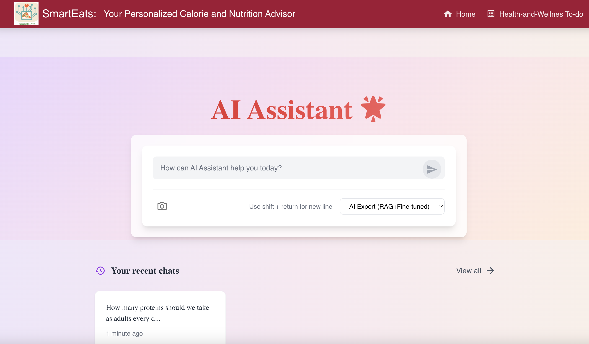
- **Planner Page:**
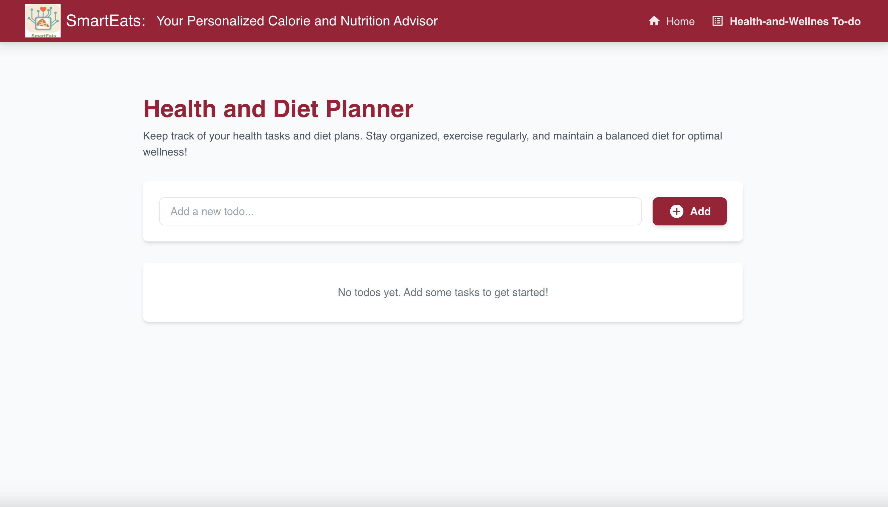


