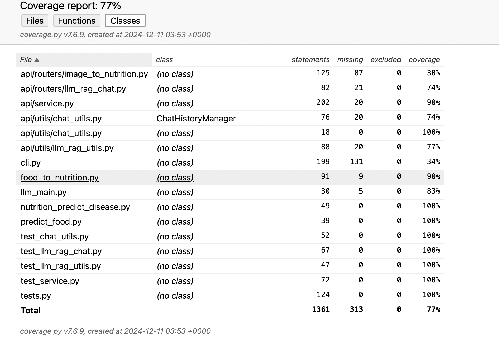

# AC215 - Milestone4 - SmartEats

### Project:
In this project, we aim to develop SmartEats, an AI-powered application that analyzes food images, predicts disease risks based on dietary habits, and offers personalized nutrition advice.
an application named SmartEats, which will take the food image as input from users and generate nutrition components with advise and potential disease risks. It will first require users to upload food pictures, and then it will use image recognition to estimate nutritional components like protein and fats and also display the amounts of each
component ideally. Based on the results, SmartEats will calculate calories, assess potential health risks, and provide tailored dietary suggestions, such as healthy recipes.

**Team Members:**
Jiayi Sun, Ninghui Hao, Qianwen Li, Taiyang Chen, Yantong Cui

**Group Name:**
The SmartEats Group

### Project Milestone 4 Organization

```
├── .github/workflows
│   ├── CI-CD.yml                          
│   └── pre-commit.yml           
├── data
├── images
│   ├── Coverage-report.png                 
│   ├── api-list-SmartEats.png                  
│   ├── solution.jpg                       
│   └── tech.png                 
├── midterm_presentation
│   └── SmartEats_AC215_M3_slides.pdf      # midterm presentation slides
├── notebooks
│   ├── AC215 - EDA.pdf                    # EDA pdf file
│   ├── AC215_image_EfficientNet.ipynb     # train EfficientNet model
│   ├── AC215_image_VGG_new.ipynb          # train VGG model
│   ├── LLM-fintuning-Documentation.pdf    # Documentation of the LLM fine-tuning process
│   ├── LLM_RAG_preprocessing.ipynb        # construct the RAG vector database
│   ├── data_versioning_cloud_storage.ipynb# view version of the dataset
│   ├── dataset3_EDA&preprocessing.ipynb   # EDA for nutrtion-disease dataset
│   ├── frontpage_v2.html                  # HTML file for application front page
│   ├── frontpage_v2.jpg                   # screenshot of front page
│   ├── image_EDA.ipynb                    # EDA for image datasets
│   └── predict_disease_ML.ipynb           # fine-tuning of a XGBClassifier model
├── references
├── reports
│   ├── APCOMP215 Project Proposal.pdf
│   ├── DataPipeline1.jpg                  # Pipeline running screenshot
│   ├── DataPipeline2.jpg                  # Pipeline running screenshot
│   ├── Examples.pdf                       # Some example inputs&outputs
│   └── Test_Documentation.pdf             # test documentaton
│   └── Final_output.png                   # Final output example
├── secrets
├── src_1container
│   ├── api                 
│   ├── docker-volumes/chromadb                   
│   └── frontend
│   └── models
└── test_action                            # container to test CI 
    ├── Dockerfile                         # To build the container for 
    ├── Pipfile                            # Define packages used in data versioning
    ├── Pipfile.lock
    ├── docker-entrypoint.sh 
    ├   ...
    ├── run-test.sh                        # shell script of running pytest within container
    └── tests.py                           # test script

```

## Running Backend and Frontend
```
cd src_1container    # move into the directory with docker-shell.sh
sh docker-shell.sh   # Then, the backend is activated
# now while runing the backend container, also run a frontend container
cd frontend          # move into the frontend directory with docker-shell.sh
sh dokcer-shell.sh   # Then, the frontend is activated
http-server          # activate the server
```
Visit http://localhost:8080/model.html

## Application Design
### Application architecture
#### Solution Architecture

#### Technical Architecture


### User interface


## Continuous Integration Setup:
We have built two functioning CI pipelines that run on every push or merge.
- Pre-commit checks: Automated build process and code quality checks using linting tools Flake8 running on GitHub Actions.
  
- Continuous Integration and Continuous Deployment: Execution of unit, integration and systems tests with test results reported.

### Coverage report


## Test Documentation:
Detailed test case descriptions and test documentation is located in the directory **reports/Test_Documentation.pdf**

#### Testing Tool Used
- PyTest: Used as the primary testing framework.
- unittest: Provides tools like patch and MagicMock to mock external dependencies such as APIs and models

#### Testing Strategy
- Unit Test
  - Validates individual functions such as process_image, food_to_nutrition, and transform_data.
  - Ensures correctness of outputs for given inputs.
  - External APIs (e.g., USDA API) and machine learning models are mocked to simulate their behavior during tests.
- Integration Test
  - Verifies that multiple components work together as expected, such as preprocessing an image and running it through the classification pipeline.
- System Test
  - Covers user flows and interactions, including building the container and running all steps in the app.
 

